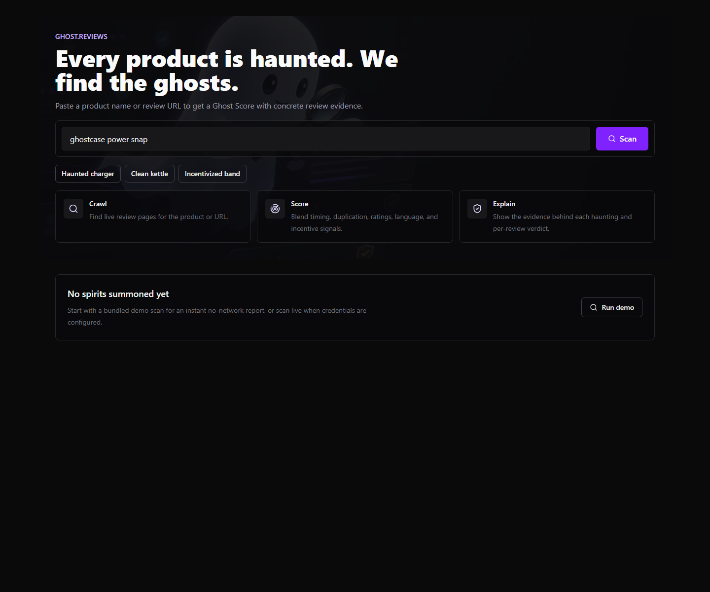
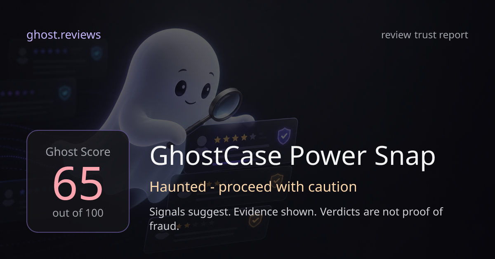

# ghost.reviews

Every product is haunted. We find the ghosts.

ghost.reviews detects suspicious, fake, or ghostwritten product reviews by crawling review sources and returning a transparent Ghost Score with evidence. It was built for the DeveloperWeek New York 2026 Hackathon, targeting the name.com Domain Roulette and Nimble live-web challenges.

## Live Demo

- Live app: https://ghost-reviews-nb3a.vercel.app
- Public repo: https://github.com/gauravpsingh07/ghost-reviews
- Best demo query: `ghostcase power snap`

The hosted demo is intentionally locked to bundled sample data so judges always get a complete report with no network flakiness or paid API dependency. Use the three example buttons in the app:

- `ghostcase power snap` - haunted charger with the strongest evidence.
- `cozybrew kettle` - cleaner baseline product.
- `glowfit pulse band` - incentivized/generic review pattern.

If a visitor searches an unmatched product, the app shows: "This hosted demo runs on bundled sample data. Try one of the example products above for a full report." It never returns the wrong sample for an arbitrary query.

## Judge Quick Read

- Domain fit: `ghost.reviews` turns "ghost" into ghostwritten/fake reviews.
- Core experience: paste a product, get a Ghost Score, then inspect the evidence.
- Differentiator: evidence-first UI, not a black-box accusation.
- Nimble story: live-web search/extract/crawl integration is implemented behind adapters; the submitted demo uses fixtures for reliability.
- Free stack: no paid APIs required; Vercel + Nimble sponsor credits + optional free LLM providers.
- Verification: lint, tests, build, env guard, and production smoke script are included.

## Screenshots





## What It Does

Paste a product name or review URL. ghost.reviews:

1. Finds review sources for the product.
2. Crawls or extracts review content through Nimble when live credentials are configured.
3. Normalizes raw review payloads into a shared `Review[]` model.
4. Scores the reviews with deterministic signals and optional free-tier LLM signals.
5. Returns a Ghost Score, verdict tier, hauntings, signal breakdown, duplicate evidence, and per-review verdicts.

Ghost Scores are evidence-backed signals, not legal conclusions or proof of fraud.

## Architecture

```text
Next.js UI
  -> POST /api/scan
    -> demo fixture loader (no network for bundled examples)
    -> Nimble source resolution + extract/crawl adapters
    -> normalized Review[]
    -> pure detection engine
    -> optional free LLM review analysis
    -> ScanResult JSON
```

Key directories:

- `src/app` - App Router pages and API routes.
- `src/components` - scan experience and result UI components.
- `src/lib/engine` - pure scoring engine and unit-tested detection signals.
- `src/lib/nimble` - Nimble client, source adapters, and payload parsers.
- `src/lib/llm` - free-provider LLM config, client wrapper, prompts, and response parsing.
- `src/lib/fixtures` - no-network demo scan results.
- `src/types` - shared product, review, signal, haunting, and scan result types.

## Detection Signals

- Review burstiness: detects suspicious timing clusters.
- Near duplication: cosine similarity over normalized review text.
- Rating anomaly: looks for unnatural rating distributions.
- Incentivized language: flags promo, refund, and free-product phrasing.
- AI-generated likelihood: optional LLM score when a free provider key is present.
- Generic language: low-specificity or template-like review wording.
- Sentiment-rating mismatch: disagreement between language sentiment and star rating.

Each signal contributes to the weighted Ghost Score and produces human-readable evidence where possible.

## API

`POST /api/scan`

```json
{
  "query": "ghostcase power snap"
}
```

Returns a `ScanResult`:

```json
{
  "product": { "name": "GhostCase Power Snap", "source": "amazon" },
  "ghostScore": 65,
  "verdict": { "tier": "haunted", "label": "Haunted - proceed with caution", "emoji": "..." },
  "reviewsAnalyzed": 10,
  "signals": {
    "burstiness": 0.78,
    "duplication": 0.82,
    "aiGenerated": 0.61,
    "generic": 0.58,
    "ratingAnomaly": 0.44,
    "sentimentMismatch": 0.4,
    "incentivized": 0.35
  },
  "hauntings": [],
  "reviews": [],
  "scannedAt": "2026-06-09T00:00:00.000Z",
  "demoMode": true
}
```

`GET /api/share-card?product=...&score=...&tier=...` returns a generated PNG share card.

## Nimble Usage

Live mode uses Nimble's SDK API base URL:

```text
https://sdk.nimbleway.com/v1
```

The Nimble layer is isolated behind `src/lib/nimble`:

- `client.ts` wraps authenticated SDK requests.
- `sources.ts` resolves a product query to likely review sources.
- `content.ts` extracts or crawls raw page content.
- `reviews.ts` maps raw payloads into normalized reviews.
- `adapters.ts` keeps source-specific Trustpilot and Amazon parsing behind a common interface.

In production, `DEMO_MODE=true` keeps the public demo reliable: fixture-matching queries return full reports, and unmatched queries receive a friendly sample-data notice instead of an unrelated fallback result. With `DEMO_MODE=false` and `NIMBLE_API_KEY` configured, the same API can attempt live crawling through the Nimble adapters.

## Free Stack

No paid APIs are required.

- Nimble: hackathon sponsor credits for live web crawl.
- LLM: Groq, Gemini, or RunPod free/sponsor-credit path.
- Demo mode: bundled fixtures, no network, no keys.
- Hosting: Vercel free tier.

Paid provider env vars are present only as optional placeholders and are disabled by default.

## Run Locally

```bash
npm install
cp .env.example .env.local
npm run dev
```

Open `http://localhost:3000` and scan one of the demo queries:

- `ghostcase power snap`
- `cozybrew kettle`
- `glowfit pulse band`

For fully offline demo behavior:

```bash
DEMO_MODE=true npm run dev
```

## Environment

Required for live crawling:

```text
NIMBLE_API_KEY=
NIMBLE_BASE_URL=https://sdk.nimbleway.com/v1
```

Optional free LLM providers:

```text
LLM_PROVIDER=groq
LLM_MODEL=llama-3.3-70b-versatile
GROQ_API_KEY=
GEMINI_API_KEY=
RUNPOD_API_KEY=
RUNPOD_ENDPOINT_URL=
```

App settings:

```text
NEXT_PUBLIC_APP_URL=http://localhost:3000
DEMO_MODE=true
```

The deployed Vercel app pins `NEXT_PUBLIC_APP_URL=https://ghost-reviews-nb3a.vercel.app` in `vercel.json` so metadata and share-card URLs point at the live hosted demo.

## Verification

```bash
npm run lint
npm test
npm run build
```

Current status: 92 tests passing, lint clean, final env guard green, local production smoke green, and production build green.

## Deployment

The repo includes:

- `vercel.json` with the Next.js build and install commands.
- `.vercelignore` to keep env files, logs, local build output, and hooks out of deploy uploads.
- `src/lib/appUrl.ts` so metadata uses `NEXT_PUBLIC_APP_URL`, Vercel production URL, Vercel preview URL, or localhost in that order.

Noninteractive CLI deploy requires Vercel authentication:

```bash
npx vercel@54.10.3 deploy --prod
```

Production deploy is currently hosted at:

```text
https://ghost-reviews-nb3a.vercel.app
```

The Vercel config keeps `DEMO_MODE=true` for judge-safe sample reports.

## Secret Safety

Never commit real keys. `.env*` is ignored except `.env.example`, and `.githooks/pre-commit` blocks staged env/key files plus key-like content. After cloning:

```bash
git config core.hooksPath .githooks
```

## Project Plan

The complete product spec, architecture, API contract, and phased commit tracker live in [`BUILD_PLAN.md`](BUILD_PLAN.md).
